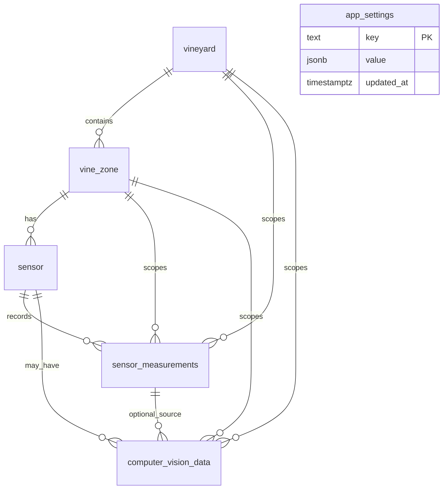
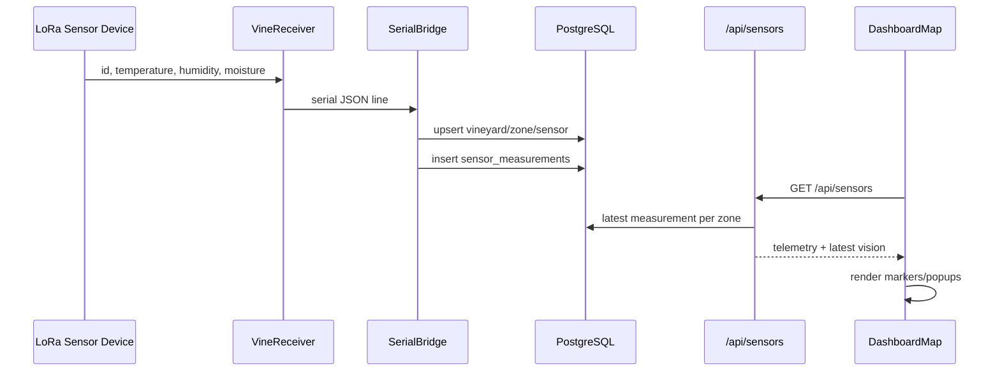
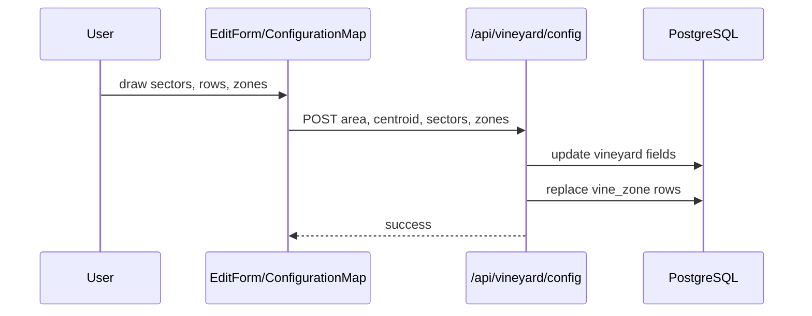
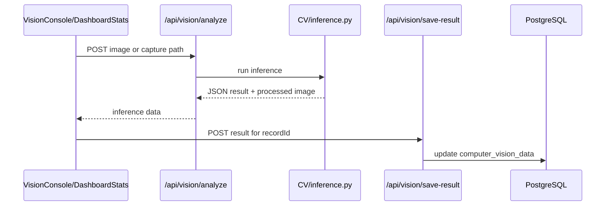
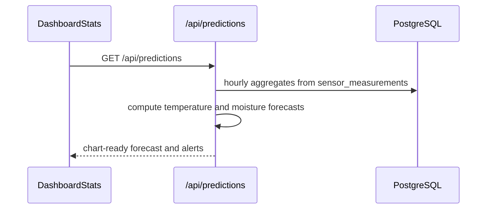

# EdgeVine Codebase Architecture Report

Last reviewed: 2026-05-18

This document describes the active EdgeVine codebase after the database split, repository cleanup, realtime transport removal, and prediction simplification. It is intended as long-term onboarding and maintenance documentation for senior engineers.

## 1. Executive Summary

EdgeVine is a vineyard monitoring application for tracking vineyard layout, zone status, sensor telemetry, and computer-vision analysis of grapes and leaves. Its business purpose is to support grape vine lifecycle monitoring by combining field sensor data, map-based vineyard configuration, image analysis, and simple environmental forecasting.

The application currently uses a deliberately small architecture:

- an Astro + React dashboard in `vineyard-dashboard/`;
- Astro API routes colocated with the dashboard;
- PostgreSQL as the single source of truth;
- direct database ingestion from the serial bridge;
- YOLO-based computer-vision scripts under `CV/`;
- LoRa firmware for physical devices under `lora/`;
- Docker Compose for Postgres and the dashboard.

The previous standalone realtime transport and prediction worker layers have been removed. Dashboard data is now loaded from PostgreSQL through API routes. Prediction data is computed directly inside the dashboard API from `sensor_measurements`; there is no external prediction service, cache process, event stream, replay mechanism, offline sync, or derived archive.

Main technologies:

- Frontend: Astro 6, React 18, Tailwind CSS, Leaflet, Leaflet Geoman, Recharts, Lucide icons.
- API/runtime: Astro server routes with the Node adapter.
- Database: PostgreSQL 16, direct SQL through `pg`.
- CV: Python, Ultralytics YOLO, OpenCV, PyTorch, matplotlib.
- Hardware: PlatformIO/Arduino, LoRa E220, DHT22, ArduinoJson.
- Ingestion: Python serial bridge with `pyserial` and `psycopg`.
- Orchestration: Docker Compose.

## 2. Project Structure Overview

### Tree Representation

```text
EdgeVine/
├── CV/
│   ├── inference.py
│   ├── train.py
│   ├── data_augmentation.py
│   ├── pyproject.toml
│   ├── uv.lock
│   ├── README.md
│   ├── train_grape_counting/
│   │   ├── weights/best.pt
│   │   ├── args.yaml
│   │   ├── BoxPR_curve.png
│   │   └── confusion_matrix_normalized.png
│   └── train_leaf_disease/
│       ├── weights/best.pt
│       ├── args.yaml
│       ├── BoxPR_curve.png
│       └── confusion_matrix_normalized.png
├── docs/
│   └── codebase-architecture-report.md
├── lora/
│   ├── SerialBridge/
│   │   ├── main.py
│   │   ├── pyproject.toml
│   │   └── uv.lock
│   ├── VineReceiver/
│   │   ├── platformio.ini
│   │   └── src/main.cpp
│   └── VineTrasmitter/
│       ├── platformio.ini
│       └── src/main.cpp
├── postgres/
│   ├── init.sql
│   └── migrations/
│       └── 001_split_sensor_measurements_and_vision.sql
├── scratch/
│   ├── check_db.js
│   ├── populate_sensor_data.sql
│   └── seed_data.py
├── vineyard-dashboard/
│   ├── Dockerfile
│   ├── package.json
│   ├── package-lock.json
│   ├── astro.config.mjs
│   ├── tailwind.config.mjs
│   ├── tsconfig.json
│   ├── icons/leaf-bold.svg
│   ├── public/
│   └── src/
│       ├── layouts/MasterLayout.astro
│       ├── pages/
│       ├── components/
│       ├── lib/
│       └── styles/global.css
├── docker-compose.yml
├── readme.md
└── .gitignore
```

### `vineyard-dashboard/`

Purpose: Main web application and server-side API layer.

Responsibilities:

- Render all user-facing pages.
- Host Astro API routes under `src/pages/api`.
- Query PostgreSQL directly through `src/lib/db.ts`.
- Run CV inference through `CV/inference.py` for uploaded or captured images.
- Compute dashboard prediction payloads directly from `sensor_measurements`.
- Manage vineyard map configuration, zone display, settings, profile data, alerts UI, and statistics.

Key files:

- `package.json`: npm scripts and frontend dependencies.
- `astro.config.mjs`: Astro server output, Node adapter, React integration, Tailwind integration.
- `Dockerfile`: Node runtime with Python CV dependencies installed by `uv`.
- `src/layouts/MasterLayout.astro`: shared application shell.
- `src/pages/*.astro`: page entry points.
- `src/pages/api/**/*.ts`: API route handlers.
- `src/components/**`: React client components.
- `src/lib/db.ts`: PostgreSQL connection pool and typed `sql()` helper.
- `src/lib/spatialUtils.ts`: geometry helpers for vineyard configuration.

Dependencies:

- PostgreSQL through `pg`.
- CV Python code through a local subprocess.
- Browser APIs for file handling and profile local storage.
- Leaflet tile URLs and Nominatim reverse geocoding.

Internal relationships:

- Astro pages import `MasterLayout` and hydrate React components with `client:load` or `client:only="react"`.
- React components call local Astro API routes with `fetch`.
- API routes call `sql()` for persistence.
- Vision APIs invoke `CV/inference.py` and update `computer_vision_data`.

### `postgres/`

Purpose: Database schema and migrations.

Responsibilities:

- Define core PostgreSQL tables.
- Seed a default vineyard/zone/sensor layout for local Docker initialization.
- Provide an additive migration from the legacy mixed data table to split telemetry and CV tables.

Key files:

- `postgres/init.sql`: canonical schema for new local databases.
- `postgres/migrations/001_split_sensor_measurements_and_vision.sql`: migration for existing deployments.

Dependencies:

- PostgreSQL 16.
- Application code assumes the tables defined by `init.sql`.

Internal relationships:

- Dashboard APIs read and write these tables.
- `lora/SerialBridge/main.py` writes sensor measurements.
- `scratch/` scripts can seed or inspect data manually.

### `CV/`

Purpose: Computer vision inference, training, augmentation, and trained model artifacts.

Responsibilities:

- Detect grape clusters.
- Detect leaf health/disease/stress states.
- Estimate yield from detected grapes.
- Write processed images with detection overlays.

Key files:

- `CV/inference.py`: runtime inference entry point used by the dashboard.
- `CV/train.py`: training/export helper.
- `CV/data_augmentation.py`: augmentation script.
- `CV/pyproject.toml`: CV runtime/training dependency manifest.
- `CV/uv.lock`: locked CV dependency graph.
- `CV/train_grape_counting/weights/best.pt`: grape detection model.
- `CV/train_leaf_disease/weights/best.pt`: leaf disease model.

Dependencies:

- Ultralytics YOLO.
- OpenCV.
- PyTorch.
- matplotlib.
- albumentations for augmentation.

Internal relationships:

- `vineyard-dashboard/src/pages/api/vision/analyze.ts` shells out to `CV/inference.py`.
- `vineyard-dashboard/src/pages/api/vision/save-result.ts` persists returned inference results.

### `lora/`

Purpose: Hardware firmware and direct serial ingestion.

Responsibilities:

- `VineTrasmitter/`: reads DHT22 and analog moisture sensors, emits LoRa JSON.
- `VineReceiver/`: receives LoRa packets and prints payloads over serial.
- `SerialBridge/`: reads serial JSON and writes telemetry directly into PostgreSQL.

Key files:

- `lora/VineTrasmitter/src/main.cpp`
- `lora/VineReceiver/src/main.cpp`
- `lora/SerialBridge/main.py`
- PlatformIO configs in `lora/VineTrasmitter/platformio.ini` and `lora/VineReceiver/platformio.ini`.

Dependencies:

- Arduino framework.
- DHT sensor library.
- LoRa_E220.
- ArduinoJson.
- Python `pyserial` and `psycopg`.

Internal relationships:

- Firmware emits JSON with `id`, `temperature`, `humidity`, and `moisture`.
- Serial bridge resolves device id to `vine_zone` and `sensor`, then inserts into `sensor_measurements`.

### `scratch/`

Purpose: Manual development and database utility scripts.

Responsibilities:

- Seed synthetic sensor and CV records.
- Inspect recent CV records.
- Provide lightweight manual database checks.

Key files:

- `scratch/populate_sensor_data.sql`
- `scratch/seed_data.py`
- `scratch/check_db.js`

Dependencies:

- Local PostgreSQL.
- `pg` for `check_db.js`.
- `psycopg` for `seed_data.py`.

These scripts are not part of the production runtime.

### Root Files

- `docker-compose.yml`: starts Postgres and the dashboard.
- `readme.md`: concise database layout and migration instructions.
- `.gitignore`: excludes generated artifacts, local IDE files, caches, Python bytecode, and frontend build output.

## 3. Application Architecture

### Architectural Style

EdgeVine is a small modular monolith around a shared PostgreSQL database:

- The dashboard is a server-rendered Astro app with client-side React islands.
- Backend behavior is implemented as Astro API route handlers.
- Persistence uses direct SQL; there is no ORM or repository abstraction.
- Hardware ingestion is handled by a separate serial bridge process that writes to the same database.
- CV is a Python subprocess invoked by the dashboard API.

The design is intentionally direct. The application has one primary UI, one database, and one active ingestion path, so extra layers such as external prediction services, event buses, transport adapters, and local caches were removed.

### Data Flow

```mermaid
flowchart LR
  HW[LoRa sensor hardware] --> RX[VineReceiver serial output]
  RX --> BRIDGE[SerialBridge Python process]
  BRIDGE --> DB[(PostgreSQL)]

  UI[Astro + React dashboard] --> API[Astro API routes]
  API --> DB
  API --> CV[CV/inference.py]
  CV --> API

  API --> PRED[/api/predictions route-local forecast]
  PRED --> DB

  DB --> UI
```

Primary flows:

1. Sensor readings move from LoRa hardware to the serial receiver, then to `lora/SerialBridge/main.py`, then to `sensor_measurements`.
2. Dashboard pages fetch state through Astro API routes.
3. API routes read/write PostgreSQL directly.
4. Vision analysis uploads or file references are processed by `CV/inference.py` and saved to `computer_vision_data`.
5. Predictions are computed on request by `src/pages/api/predictions.ts` from recent `sensor_measurements`.

### Request Lifecycle

For dashboard routes:

1. Browser requests an Astro page such as `/`, `/statistics`, or `/edit`.
2. Astro renders the page and shared layout.
3. The React island hydrates in the browser.
4. The component calls one or more `/api/*` endpoints.
5. API routes query PostgreSQL through `sql()`.
6. JSON responses update component-local React state.

For vision analysis:

1. Browser posts an uploaded image or existing capture path to `/api/vision/analyze`.
2. The route writes the upload or resolves the capture path.
3. The route executes `python3 ../CV/inference.py`.
4. The route copies the processed image into `vineyard-dashboard/public/cv_results`.
5. The result can be saved to `computer_vision_data` through `/api/vision/save-result`.

For predictions:

1. `DashboardStats` calls `/api/predictions`.
2. The route aggregates the last 30 days of `sensor_measurements` by hour.
3. Route-local helper functions generate 48-hour temperature and 72-hour moisture forecasts.
4. The route returns the same chart-friendly shape expected by the existing UI.

### State Management

State management is local and simple:

- React `useState` and `useEffect` manage component state.
- Server state is fetched manually with `fetch`.
- Profile state is stored in browser `localStorage` and propagated with a `profile-updated` `CustomEvent`.
- The Postgres connection pool is cached on `globalThis` in development to avoid hot-reload pool churn.

No Redux store, context store, SWR/React Query cache, offline persistence, event replay, or queue state exists.

### Rendering Strategy

- Astro renders page shells on the server.
- React components are hydrated as islands.
- Leaflet-heavy map components use `client:only="react"` where browser APIs are required.
- Charts use Recharts in hydrated React components.
- Static assets are served from `vineyard-dashboard/public`.

### API Communication Flow

Components call relative API URLs:

- `DashboardContainer` and maps call `/api/vineyard/config` and `/api/sensors`.
- `DashboardStats` calls `/api/vineyard/config`, `/api/vineyard/stats`, `/api/predictions`, `/api/vision/analyze`, and `/api/vision/save-result`.
- `VisionConsole` calls `/api/vision/analyze`.
- `SettingsDashboard` calls `/api/settings`.
- `ProfileForm` calls `/api/vineyard/config` and uses `localStorage`.

The API layer returns JSON directly. Error handling is route-specific and generally returns `{ success: false, error }`.

### Background Jobs and Workers

Active background/runtime processes:

- `lora/SerialBridge/main.py`: long-running serial reader that inserts measurements into Postgres.
- Firmware loops in `VineTrasmitter` and `VineReceiver`.

Removed background/runtime processes:

- The realtime transport subscriber and broker-dependent ingestion path.
- The standalone analytics archive worker.
- The standalone prediction server and scheduler.

### Authentication and Authorization

No real authentication or authorization system is implemented.

- `/login` is a static form that redirects to `/`.
- API routes do not validate user sessions or permissions.
- The database schema supports an `owner` and profile fields, but there is no enforced multi-user access control.

### Configuration and Environment Handling

Dashboard database configuration:

- `DATABASE_URL`
- `POSTGRES_HOST`
- `POSTGRES_PORT`
- `POSTGRES_DB`
- `POSTGRES_USER`
- `POSTGRES_PASSWORD`

Dashboard zone status thresholds:

- `ZONE_STALE_MINUTES`
- `ZONE_TEMPERATURE_MIN`
- `ZONE_TEMPERATURE_MAX`
- `ZONE_HUMIDITY_MIN`
- `ZONE_MOISTURE_MIN`

Serial bridge configuration:

- `SERIAL_PORT`
- `SERIAL_BAUDRATE`
- `POSTGRES_*`
- `VINEYARD_ID`
- `VINEYARD_NAME`

Vision settings are stored in `app_settings` under key `vision`.

## 4. Component & Module Breakdown

### Layout and Navigation

#### `src/layouts/MasterLayout.astro`

What it does: Provides the shared HTML shell, global stylesheet, sidebar, and header.

Inputs/outputs:

- Input: page title and slotted page content.
- Output: full page layout.

Dependencies:

- `src/components/common/Sidebar.tsx`
- `src/components/common/Header.tsx`
- `src/styles/global.css`

Used by all `.astro` pages.

#### `src/components/common/Sidebar.tsx`

What it does: Renders primary navigation.

Dependencies:

- `lucide-react` icons.
- Current browser path for active state.

Routes:

- `/`
- `/edit`
- `/statistics`
- `/vision`
- `/alerts`
- `/settings`
- `/profile`

#### `src/components/common/Header.tsx`

What it does: Renders the top application header, profile image, and profile metadata.

Dependencies:

- Browser `localStorage`.
- `profile-updated` custom event.

Critical behavior:

- Profile edits are reflected without a full page reload.

### Dashboard and Map

#### `src/pages/index.astro`

Purpose: Dashboard home route.

Uses:

- `DashboardContainer`

#### `src/components/dashboard/DashboardContainer.tsx`

What it does:

- Loads vineyard configuration.
- Loads sensor status from `/api/sensors`.
- Fetches current weather from Open-Meteo forecast API using vineyard coordinates.
- Passes map and status data to `DashboardMap`.

Inputs:

- None directly; all data is fetched client-side.

Outputs:

- Dashboard map and summary UI.

Dependencies:

- `/api/vineyard/config`
- `/api/sensors`
- Open-Meteo current forecast endpoint.

#### `src/components/map/DashboardMap.tsx`

What it does:

- Displays vineyard geometry, zones, rows, sensor markers, and popups.
- Converts zone and telemetry status into marker styling.
- Shows latest telemetry and latest CV data per zone.

Inputs:

- Vineyard config.
- Sensor/zone status payload.
- Current weather data.

Dependencies:

- Leaflet.
- `@geoman-io/leaflet-geoman-free`.
- Local CSS classes and marker rendering.

Business rules:

- Zones with stale or out-of-threshold readings are visually distinguished.
- Latest telemetry comes from `sensor_measurements`.
- Latest CV status comes from `computer_vision_data`.

#### `src/components/map/ConfigurationMap.tsx`

What it does:

- Allows editing vineyard boundaries, sectors, rows, and sensor/zone positions.
- Produces configuration data consumed by `EditForm`.

Dependencies:

- Leaflet and Geoman drawing tools.
- `src/lib/spatialUtils.ts`.

### Vineyard Configuration

#### `src/pages/edit.astro`

Purpose: Vineyard configuration route.

Uses:

- `EditForm`

#### `src/components/edit/EditForm.tsx`

What it does:

- Loads existing vineyard configuration.
- Coordinates map edits and form fields.
- Saves configuration to `/api/vineyard/config`.

Inputs:

- API-loaded vineyard data.
- User-edited boundaries, sectors, rows, and zones.

Outputs:

- POST body to `/api/vineyard/config`.

Critical business rule:

- The current save strategy replaces zone rows. Because `vine_zone` has cascading foreign keys, this can delete dependent sensor, measurement, and CV rows if existing zone ids are replaced. This is a known data integrity risk.

### Statistics and Prediction UI

#### `src/pages/statistics.astro`

Purpose: Statistics route.

Uses:

- `DashboardStats`

#### `src/components/stats/DashboardStats.tsx`

What it does:

- Displays current telemetry KPIs.
- Displays historical telemetry charts.
- Displays database-driven temperature and moisture forecasts.
- Displays CV capture history, yield estimates, and canopy health.
- Allows image analysis from recent capture cards.

Inputs:

- `/api/vineyard/config`
- `/api/vineyard/stats?range=...`
- `/api/predictions`
- `/api/vision/analyze`
- `/api/vision/save-result`

Outputs:

- Local chart state.
- Optional CV result updates to `computer_vision_data`.

Critical business rules:

- Health percentages are derived from leaf counts.
- Yield totals are aggregated from latest CV rows per zone.
- Prediction charts expect `temperature.forecast` and `moisture.forecast` arrays with `ds`, `yhat`, `yhat_lower`, and `yhat_upper`.

### Vision UI

#### `src/pages/vision.astro`

Purpose: Manual image analysis route.

Uses:

- `VisionConsole`

#### `src/components/vision/VisionConsole.tsx`

What it does:

- Uploads an image.
- Sends it to `/api/vision/analyze`.
- Displays grape count, health prediction, yield estimate, leaf counts, and processed image.

Inputs:

- User-selected image.
- Optional settings from `/api/settings`.

Outputs:

- Analysis result rendered in the browser.

### Settings and Profile

#### `src/components/settings/SettingsDashboard.tsx`

What it does:

- Reads and writes vision uncertainty settings.

Dependencies:

- `/api/settings`
- `app_settings` table.

#### `src/components/profile/ProfileForm.tsx`

What it does:

- Manages local user-facing profile metadata.
- Syncs vineyard profile fields through `/api/vineyard/config`.

Dependencies:

- Browser `localStorage`.
- `/api/vineyard/config`

### Alerts

#### `src/components/alerts/AlertsView.tsx`

What it does:

- Renders alert-focused dashboard UI.
- Uses the configured vineyard map as context.
- Simulates alert records locally.

Dependencies:

- `/api/vineyard/config`
- Leaflet.

Note: Alerts are currently UI-local and not persisted as a database table.

### API Routes

#### `src/pages/api/sensors.ts`

What it does:

- Returns one row per configured zone with latest telemetry and latest CV status.

Reads:

- `vine_zone`
- `vineyard`
- latest `sensor_measurements`
- latest `computer_vision_data`

Used by:

- `DashboardContainer`
- `DashboardMap`

#### `src/pages/api/sensors/history.ts`

What it does:

- Returns recent measurement history.

Reads:

- `sensor_measurements`

#### `src/pages/api/vineyard/config.ts`

What it does:

- `GET`: returns the current vineyard, sectors, and zones.
- `POST`: updates vineyard profile/map fields and rewrites zones.

Reads/writes:

- `vineyard`
- `vine_zone`

External integration:

- Nominatim reverse geocoding when coordinates are available and no address is supplied.

#### `src/pages/api/vineyard/stats.ts`

What it does:

- Aggregates current telemetry, historical chart rows, health data, recent captures, and yield totals.

Reads:

- `sensor_measurements`
- `computer_vision_data`
- `vine_zone`
- `app_settings`

Used by:

- `DashboardStats`

#### `src/pages/api/predictions.ts`

What it does:

- Reads recent hourly aggregates from `sensor_measurements`.
- Computes a simple route-local temperature forecast for 48 hours.
- Computes a simple route-local soil moisture forecast for 72 hours.
- Returns chart-compatible forecast and alert payloads.

Why it exists:

- Keeps prediction behavior in the dashboard domain where it is currently used.
- Avoids a standalone service, background scheduler, derived archive, and cache layer.

Inputs:

- Last 30 days of hourly aggregated `temperature`, `humidity`, and `moisture`.

Outputs:

- `{ success, status, data: { moisture, temperature } }`
- Each forecast has `forecast`, `alerts`, and `last_updated`.

Internal logic:

- Normalizes database rows into timestamped points.
- Computes recent trend from the last 12 valid values.
- Blends recent trend with same-hour historical averages.
- Widens lower/upper bounds over the forecast horizon.
- Raises frost alert at or below 2 C.
- Raises water stress alert below 25% moisture.

#### `src/pages/api/settings.ts`

What it does:

- Reads/writes app settings JSON.

Reads/writes:

- `app_settings`

#### `src/pages/api/vision/analyze.ts`

What it does:

- Accepts uploaded images or existing capture image paths.
- Runs `CV/inference.py`.
- Copies processed image output into `public/cv_results`.

Risk:

- Uses `child_process.exec` with a constructed command string. Paths are quoted, but `spawn`/`execFile` with argument arrays would be safer.

#### `src/pages/api/vision/save-result.ts`

What it does:

- Persists analysis result fields into `computer_vision_data`.

Writes:

- `computer_vision_data`

#### `src/pages/api/vineyard/seed.ts`

What it does:

- Seeds demo telemetry and CV records for configured zones.

Writes:

- `sensor`
- `sensor_measurements`
- `computer_vision_data`

### Shared Libraries

#### `src/lib/db.ts`

What it does:

- Creates a PostgreSQL pool.
- Exposes `sql<T>()` for parameterized queries.
- Reuses the pool through `globalThis` in development.

Dependencies:

- `pg`

#### `src/lib/spatialUtils.ts`

What it does:

- Supports vineyard row and zone geometry generation.
- Keeps geometry helper logic out of React components.

Dependencies:

- Turf helpers imported through Geoman's transitive dependency tree. These should be made direct dependencies if the helpers remain imported directly.

### CV Modules

#### `CV/inference.py`

What it does:

- Loads grape and leaf YOLO models.
- Runs detection on an input image.
- Calculates grape count, leaf health classes, and estimated liters.
- Writes a processed image.
- Prints JSON consumed by the dashboard API.

Inputs:

- Image path.
- Output path.
- Optional depth uncertainty value.

Outputs:

- JSON with counts, health prediction, yield estimates, and image path.

#### `CV/train.py`

What it does:

- Training/export script for YOLO models.

Runtime status:

- Not used by the dashboard runtime.
- Kept because it is model-maintenance code.

#### `CV/data_augmentation.py`

What it does:

- Augments image datasets for model training.

Runtime status:

- Not used by the dashboard runtime.
- Kept because it supports future model maintenance.

### Serial and Firmware Modules

#### `lora/SerialBridge/main.py`

What it does:

- Opens a serial port.
- Parses JSON lines from the receiver.
- Ensures vineyard/zone/sensor rows exist.
- Inserts into `sensor_measurements`.

Inputs:

- Serial payload with `id`, `temperature`, `humidity`, `moisture`.

Outputs:

- PostgreSQL insert.

#### `lora/VineTrasmitter/src/main.cpp`

What it does:

- Reads DHT22 temperature/humidity and analog moisture.
- Sends JSON through LoRa E220.

#### `lora/VineReceiver/src/main.cpp`

What it does:

- Receives LoRa messages.
- Prints payloads over serial for the bridge process.

### CLI and Manual Scripts

- `scratch/seed_data.py`: inserts synthetic split-schema data.
- `scratch/populate_sensor_data.sql`: SQL seed script.
- `scratch/check_db.js`: prints recent CV records.

## 5. Dependency Graph

### Runtime Dependency Diagram

```mermaid
flowchart TD
  UI[React Components]
  PAGES[Astro Pages]
  API[Astro API Routes]
  DBLIB[src/lib/db.ts]
  DB[(PostgreSQL)]
  CVAPI[/api/vision/analyze]
  CVPY[CV/inference.py]
  PRED[/api/predictions]
  STATS[/api/vineyard/stats]
  SERIAL[lora/SerialBridge/main.py]
  FW[LoRa Firmware]

  PAGES --> UI
  UI --> API
  API --> DBLIB
  DBLIB --> DB
  CVAPI --> CVPY
  CVPY --> CVAPI
  PRED --> DBLIB
  STATS --> DBLIB
  FW --> SERIAL
  SERIAL --> DB
```

### Main Module Dependencies

- Components depend on API routes, not directly on database code.
- API routes depend on `src/lib/db.ts`.
- Vision API depends on `CV/inference.py` and model weights in `CV/train_*`.
- SerialBridge depends on PostgreSQL schema and serial hardware.
- Firmware is independent from the dashboard and only communicates by serial payload.

### Core Execution Paths

1. Sensor telemetry: firmware -> serial bridge -> `sensor_measurements` -> dashboard APIs -> map/statistics/prediction views.
2. Vineyard configuration: `EditForm` -> `/api/vineyard/config` -> `vineyard` and `vine_zone`.
3. Vision analysis: UI -> `/api/vision/analyze` -> `CV/inference.py` -> `/api/vision/save-result` -> `computer_vision_data`.
4. Prediction: `DashboardStats` -> `/api/predictions` -> hourly aggregates from `sensor_measurements` -> route-local forecast JSON.

### Tight Couplings

- `DashboardStats` expects specific JSON shapes from `/api/vineyard/stats`, `/api/predictions`, and vision routes.
- `CV/inference.py` JSON output shape is coupled to `vision/analyze.ts` and UI display code.
- Vineyard configuration save behavior is coupled to `vine_zone` cascade relationships.
- Prediction logic is intentionally colocated in `/api/predictions` because it currently has one consumer.

### Potential Bottlenecks

- `sensor_measurements` can grow without partitioning or retention.
- Prediction queries aggregate 30 days of data on demand.
- CV inference runs synchronously from an HTTP request and can be slow.
- Map rendering and chart rendering are client-heavy on large datasets.

## 6. Routing & API Documentation

### Pages

| Route | File | Main Component | Purpose |
| --- | --- | --- | --- |
| `/` | `src/pages/index.astro` | `DashboardContainer` | Main vineyard status map |
| `/edit` | `src/pages/edit.astro` | `EditForm` | Vineyard geometry/configuration |
| `/statistics` | `src/pages/statistics.astro` | `DashboardStats` | Telemetry, predictions, CV stats |
| `/vision` | `src/pages/vision.astro` | `VisionConsole` | Manual CV analysis |
| `/alerts` | `src/pages/alerts.astro` | `AlertsView` | Alert-oriented view |
| `/settings` | `src/pages/settings.astro` | `SettingsDashboard` | App settings |
| `/profile` | `src/pages/profile.astro` | `ProfileForm` | Profile editing |
| `/login` | `src/pages/login.astro` | Static form | Non-auth login placeholder |

### API Endpoints

#### `GET /api/sensors`

Request: no parameters.

Response:

- `success`
- `data[]` containing zone id/name/location, telemetry, status, and latest CV fields.

Flow:

1. Query zones and vineyard.
2. Lateral join latest measurement per zone.
3. Lateral join latest CV row per zone.
4. Compute status labels and stale state.

#### `GET /api/sensors/history`

Request: no parameters.

Response:

- Recent measurement rows.

#### `GET /api/vineyard/config`

Response:

- Vineyard profile.
- Sectors JSON.
- Zones.

#### `POST /api/vineyard/config`

Request:

- Vineyard geometry/profile fields.
- Sectors.
- Zones.

Response:

- `{ success: true }` on save.

Risk:

- Current zone replacement strategy can cascade-delete dependent data.

#### `GET /api/vineyard/stats?range=24h|7d|30d|90d|1y`

Response:

- `global`: averaged latest telemetry.
- `health`: leaf health totals.
- `production`: CV-based yield estimates.
- `chartData`: historical telemetry chart points.
- `recentCaptures`: recent CV image rows.

Validation:

- Range is mapped to a fixed SQL interval list in code.

#### `GET /api/predictions`

Response:

```json
{
  "success": true,
  "status": "ready",
  "data": {
    "moisture": {
      "forecast": [{ "ds": "...", "yhat": 0, "yhat_lower": 0, "yhat_upper": 0 }],
      "alerts": { "status": "OK", "danger_start_time": null, "min_value": 0, "min_time": "..." },
      "last_updated": "..."
    },
    "temperature": {
      "forecast": [{ "ds": "...", "yhat": 0, "yhat_lower": 0, "yhat_upper": 0 }],
      "alerts": { "status": "OK", "danger_start_time": null, "min_value": 0, "min_time": "..." },
      "last_updated": "..."
    }
  }
}
```

Flow:

1. Query 30 days of hourly telemetry aggregates.
2. Normalize rows.
3. Build 48-hour temperature forecast.
4. Build 72-hour moisture forecast.
5. Return graceful `success: false` if no data or query failure.

#### `GET /api/settings`

Response:

- JSON settings stored under `app_settings.key = 'vision'`.

#### `POST /api/settings`

Writes:

- `app_settings.value`.

#### `POST /api/vision/analyze`

Request:

- Multipart upload or existing image path.

Response:

- CV inference result.

#### `POST /api/vision/save-result`

Request:

- `recordId`
- optional CV fields.

Writes:

- `computer_vision_data`.

#### `GET /api/vineyard/seed`

Purpose:

- Local/demo seed operation.

### Middleware Chain

No custom middleware is present. Astro API routes execute directly.

### Validation Layer

Validation is route-local and minimal. There is no shared schema validator such as Zod. This keeps the code small, but it also means endpoint behavior is less uniform.

### Error Handling

- Most routes return JSON with `success: false`.
- `/api/predictions` intentionally returns HTTP 200 on failure so the statistics UI can hide the prediction section gracefully.
- Server errors are logged with `console.error`.

## 7. Database & Persistence Layer

### Schema Overview



`app_settings` is a standalone key-value table and does not participate in the vineyard hierarchy.

### Tables

#### `vineyard`

Stores vineyard records. The current UI generally assumes the first vineyard row.

Important fields:

- `id`
- `name`
- `owner`
- `altitude`
- `latitude`
- `longitude`
- `province`
- `region`
- `address`
- `email`
- `name_vineyard`
- `area`
- `sectors` JSONB
- row/sector totals.

#### `vine_zone`

Stores zones inside a vineyard.

Important fields:

- `id`
- `number`
- `vineyard_id`
- `name`
- `external_id`
- `latitude`
- `longitude`
- `sector_id`

Constraints:

- Unique `(vineyard_id, number)`.
- Foreign key to `vineyard` with cascade delete.

#### `sensor`

Stores physical/logical sensors for a zone.

Important fields:

- `id`
- `zone_id`
- `external_id`
- `name`
- `created_at`

Constraints:

- Unique `(zone_id, external_id)`.
- Foreign key to `vine_zone` with cascade delete.

#### `sensor_measurements`

Dedicated telemetry history table.

Fields:

- `id`
- `sensor_id`
- `zone_id`
- `vineyard_id`
- `temperature`
- `humidity`
- `moisture`
- `timestamp`
- `created_at`

Used by:

- `/api/sensors`
- `/api/sensors/history`
- `/api/vineyard/stats`
- `/api/predictions`
- `lora/SerialBridge/main.py`

#### `computer_vision_data`

Dedicated CV history/results table.

Fields:

- `id`
- `sensor_id`
- `zone_id`
- `vineyard_id`
- `sensor_measurement_id`
- `timestamp`
- `image_url`
- `processed_image_url`
- `grape_count`
- `health_status`
- `estimated_liters`
- `estimated_liters_min`
- `estimated_liters_max`
- `leaf_healthy_count`
- `leaf_stress_count`
- `leaf_disease_count`
- `created_at`

Used by:

- `/api/sensors`
- `/api/vineyard/stats`
- `/api/vision/save-result`

#### `app_settings`

Stores small JSON settings.

Fields:

- `key`
- `value`
- `updated_at`

Current key:

- `vision`

### ORM / Query Builder

No ORM is used. TypeScript code uses `pg` through `src/lib/db.ts`. Python serial ingestion uses `psycopg`.

### Migrations

Current migration:

- `postgres/migrations/001_split_sensor_measurements_and_vision.sql`

Purpose:

- Creates `sensor`, `sensor_measurements`, `computer_vision_data`, and `app_settings`.
- Migrates compatible legacy `sensor_data` rows when present.
- Leaves the legacy table in place for verification.

### Persistence Strategy

PostgreSQL is the only persistent application store. Derived state is recomputed from database reads where practical. Prediction data is not stored or cached.

### Caching Strategy

- Development Postgres pool reuse via `globalThis`.
- Browser state in React/localStorage.
- No server-side prediction cache.
- No derived Parquet/archive cache.
- No offline persistence.

## 8. State Management

### Global State

There is no application-wide React store.

Global-ish state:

- Browser `localStorage` stores profile metadata.
- `globalThis.vineyardDashboardPool` stores the development DB pool.

### Local State

Local React state exists in:

- `DashboardContainer`
- `DashboardStats`
- `VisionConsole`
- `EditForm`
- `SettingsDashboard`
- `ProfileForm`
- `AlertsView`

### Server State

Server state is fetched on demand through API routes. There is no client-side server-state library.

### Data Synchronization

Synchronization is direct:

- Serial bridge inserts telemetry into Postgres.
- Dashboard fetches current database state.
- Settings/profile/configuration writes go directly to API routes.

### Cache Invalidation

There is no formal cache invalidation system. Components refetch after user actions where needed.

### Reactive Flows

- Profile updates dispatch a browser `profile-updated` event.
- Map and chart state rerenders through React state changes.
- No transport-level event listeners or stream subscriptions remain.

## 9. Build & Runtime System

### Build Pipeline

Dashboard scripts from `vineyard-dashboard/package.json`:

```json
{
  "dev": "astro dev",
  "start": "astro dev",
  "build": "astro build",
  "preview": "astro preview",
  "typecheck": "tsc --noEmit"
}
```

Important points:

- `npm run build` produces an Astro server build.
- `npm run typecheck` runs strict TypeScript checks.
- There are no lint or test scripts currently defined.
- Python dependencies are managed with `uv`; legacy `pip`/`requirements.txt` install flows are not used.

Python projects:

- `CV/pyproject.toml` and `CV/uv.lock` define the computer-vision environment.
- `lora/SerialBridge/pyproject.toml` and `lora/SerialBridge/uv.lock` define the serial bridge environment.
- `vineyard-dashboard/Dockerfile` creates `/opt/venv` with `uv venv` and installs locked CV dependencies with `uv sync --frozen --no-dev --active`.

### Bundlers

- Astro/Vite builds the dashboard.
- Tailwind processes CSS.
- React is compiled through the Astro React integration.

### Environment Configs

`docker-compose.yml` defines:

- Postgres credentials.
- Dashboard database connection.
- Zone threshold environment variables.
- Dashboard host/port.

### Deployment Assumptions

Docker Compose starts:

- `postgres`
- `vineyard-dashboard`

The dashboard container mounts:

- `./vineyard-dashboard:/app`
- `/app/node_modules`
- `./CV:/CV`

The dashboard image is built from the repository root with `vineyard-dashboard/Dockerfile` so the Docker build can access the locked CV dependency files. The root `.dockerignore` keeps generated output, local virtualenvs, firmware build output, and model weights out of the Docker build context.

The Dockerfile currently runs the development server command. A production deployment should consider `astro build` plus `astro preview` or a Node standalone server command.

### CI/CD Integration

No CI/CD configuration was found in the repository.

### Scripts and Automation

Manual validation commands:

```sh
cd vineyard-dashboard
npm run typecheck
npm run build
```

Python syntax check example:

```sh
python -m py_compile lora/SerialBridge/main.py CV/inference.py CV/train.py CV/data_augmentation.py scratch/seed_data.py
```

Docker config validation:

```sh
docker compose config
```

## 10. External Integrations

### PostgreSQL

Used by:

- Dashboard API routes.
- Serial bridge.
- Scratch scripts.

### Serial / LoRa Hardware

Used by:

- `lora/VineTrasmitter/src/main.cpp`
- `lora/VineReceiver/src/main.cpp`
- `lora/SerialBridge/main.py`

The application expects JSON readings with `id`, `temperature`, `humidity`, and `moisture`.

### Open-Meteo

Used by:

- `DashboardContainer` for current weather display.

Historical weather enrichment is not part of the active prediction flow.

### Nominatim / OpenStreetMap Reverse Geocoding

Used by:

- `/api/vineyard/config` when saving vineyard coordinates without address metadata.

### Map Tiles

Used by:

- Leaflet map components.

### YOLO / Ultralytics

Used by:

- `CV/inference.py`.

### Browser Storage and Events

Used by:

- `ProfileForm`
- `Header`

## 11. Technical Debt & Risks

### Security Risks

- No real authentication or authorization exists.
- `/api/vision/analyze` shells out through `exec`; `spawn` or `execFile` with argument arrays would reduce command-construction risk.
- Upload and processed-image lifecycle management is minimal.
- API validation is ad hoc and route-local.

### Data Integrity Risks

- `/api/vineyard/config` deletes and reinserts zones, which can cascade to sensors, measurements, and CV rows.
- Current UI assumes a primary/first vineyard in several places.
- No retention policy exists for `sensor_measurements` or `computer_vision_data`.

### Operational Risks

- Dashboard Dockerfile runs the development server command.
- CV inference can be slow and runs during an HTTP request.
- Serial bridge has no supervisor configuration in Docker Compose.
- No CI/CD pipeline is present.

### Code Quality Risks

- Large React components combine fetching, transformation, and rendering.
- Route-local validation is inconsistent.
- Some scripts have hard-coded local defaults.
- Direct Turf imports should be declared as direct dependencies if retained.

### Performance Risks

- Historical and prediction queries can become expensive as `sensor_measurements` grows.
- CV images in `public/cv_results` can accumulate without cleanup.
- Leaflet rendering can degrade with very large zone/row configurations.

## 12. Developer Onboarding Guide

### Prerequisites

- Node.js 22 or compatible.
- npm.
- Docker and Docker Compose.
- Python 3 for CV/serial scripts.
- `uv` for Python dependency management.
- PostgreSQL client tools for manual migration/debugging.
- PlatformIO for firmware work.

### Run Dashboard Locally

```sh
cd vineyard-dashboard
npm install
npm run dev
```

Default app URL:

- `http://localhost:4321`

Set up local CV dependencies when running vision inference outside Docker:

```sh
cd CV
uv sync --frozen
```

Set up the serial bridge:

```sh
cd lora/SerialBridge
uv sync --frozen
uv run python main.py
```

### Run Full Stack with Docker Compose

```sh
docker compose up --build
```

Services:

- Postgres on `localhost:5432`.
- Dashboard on `localhost:4321`.

### Database Setup

New local Docker volumes initialize from:

```sh
postgres/init.sql
```

Existing deployments with the legacy mixed table can run:

```sh
psql "$DATABASE_URL" -f postgres/migrations/001_split_sensor_measurements_and_vision.sql
```

### Common Workflows

Configure vineyard:

1. Open `/edit`.
2. Draw or edit geometry.
3. Save configuration.
4. Verify `/` renders sectors/zones.

Inspect telemetry:

1. Insert readings through SerialBridge or seed scripts.
2. Open `/`.
3. Open `/statistics`.

Run CV analysis:

1. Open `/vision`.
2. Upload an image.
3. Review processed image and metrics.

Check predictions:

1. Ensure `sensor_measurements` has recent data.
2. Open `/statistics`.
3. Verify forecast cards render.

### Debugging Approach

- Dashboard API errors: inspect terminal logs from `npm run dev` or container logs.
- Database issues: connect to Postgres and inspect schema/table contents.
- Prediction issues: call `/api/predictions` directly and verify recent rows in `sensor_measurements`.
- CV issues: run `CV/inference.py` manually with an image and output path.
- Serial issues: verify receiver prints valid JSON lines.

### Testing Strategy

Current state:

- No unit test script exists.
- No lint script exists.
- TypeScript typechecking and production build are the main automated checks.
- Python files can be syntax-checked with `py_compile`.
- Docker Compose configuration can be validated with `docker compose config`.

### Deployment Process

No formal deployment pipeline is defined. Current deployment assumptions are Docker Compose based. A production hardening pass should define:

- production Astro start command;
- secrets management;
- database migrations;
- serial bridge process supervision;
- image retention policy;
- authentication.

## 13. Cleanup Summary

### Removed

- Realtime transport subscriber directory under `mqtt-server/mqtt-subscriber/`.
- Standalone analytics/prediction service under `mqtt-server/analytics/`.
- Derived analytics archive file and notebook tied to the removed service.
- Arduino test publisher sketch under `test-script.ino/`.
- Analytics services from `docker-compose.yml`.
- Dashboard dependency on `ANALYTICS_API_URL` and the external prediction HTTP service.
- Legacy CV dependency file in favor of `CV/pyproject.toml` and `CV/uv.lock`.

Earlier cleanup also removed:

- Legacy Next app under `vineyard-dashboard/app_vecchia`.
- Old Next config files.
- Generated Astro output and checked-in build artifacts.
- Unused legacy React components and helper modules.
- Root `package-lock.json` without a root package manifest.

### Why Removable

- The dashboard already reads current state from PostgreSQL.
- Sensor ingestion now has a direct database path through `lora/SerialBridge/main.py`.
- Prediction data is computed from `sensor_measurements` on request.
- The removed analytics service only existed to maintain a derived archive and serve cached forecasts.
- No remaining active code imports or executes the removed files.
- Docker and local Python setup now use locked `uv` environments.

### Intentionally Kept

- CV model weights and training artifacts because runtime inference depends on weights and model maintenance may need the training metadata.
- `scratch/` scripts because they are useful manual DB utilities.
- LoRa firmware and SerialBridge because they are the active hardware ingestion path.
- Database migration files because existing deployments may still need them.

### Risk Notes

- Forecast behavior changed from an external Prophet model to a direct lightweight heuristic. The UI shape is preserved, but numerical results will differ.
- Removing the standalone analytics service removes historical weather enrichment from predictions.
- SerialBridge must be the active ingestion path for live hardware data.

### Future Cleanup Opportunities

- Split large UI components only where it improves readability.
- Add direct Turf dependencies if `spatialUtils.ts` continues to import Turf packages directly.
- Add lint/test scripts.
- Add retention/rollup strategy for telemetry and image outputs.

## 14. Suggested Improvements

### Architectural Improvements

- Add real authentication and route protection.
- Make vineyard selection explicit instead of relying on the first vineyard row.
- Replace zone delete/reinsert with stable upserts to preserve measurement history.
- Move CV subprocess execution to `spawn`/`execFile`.

### Simplification Opportunities

- Keep prediction logic route-local until another module needs it.
- Avoid introducing a repository layer unless multiple routes start duplicating complex queries.
- Consolidate repeated fetch/loading/error patterns in UI only after duplication becomes painful.

### Performance Optimizations

- Add indexes or rollups for common time-window telemetry queries.
- Add retention or partitioning for `sensor_measurements`.
- Paginate or limit CV capture history more explicitly.
- Move heavy CV inference out of synchronous HTTP if usage grows.

### DX Improvements

- Add `lint`, `test`, and `format` scripts.
- Add a small API contract test for `/api/predictions`.
- Add a Docker Compose service for SerialBridge if hardware deployment needs supervision.
- Document required CV model files and expected image paths.

### Refactoring Ideas

- Extract small chart/panel components from `DashboardStats` after behavior stabilizes.
- Introduce a tiny validation helper for API request parsing.
- Add a `vineyard_id` parameter convention across APIs before supporting multiple vineyards.
- Add migration tooling instead of applying raw SQL manually.

## Glossary

- Vineyard: Top-level grower/site entity.
- Zone: A spatial subdivision inside a vineyard.
- Sensor: Physical/logical source of telemetry for a zone.
- Sensor Measurement: A timestamped telemetry row with temperature, humidity, and moisture.
- Computer Vision Data: Image and inference result row for grape/leaf analysis.
- SerialBridge: Python process that reads receiver serial output and writes telemetry to Postgres.
- Forecast: Dashboard-generated future temperature or moisture estimate from recent database measurements.
- App Settings: JSON settings stored in `app_settings`.

## Dependency Summary

### Dashboard

- Astro, React, Tailwind, Vite.
- Leaflet, Leaflet Geoman.
- Recharts.
- Lucide icons.
- PostgreSQL `pg`.

### Database

- PostgreSQL 16.
- SQL schema/migrations in `postgres/`.

### CV

- Python.
- Ultralytics YOLO.
- OpenCV.
- PyTorch.
- matplotlib.
- albumentations.

### Hardware

- Arduino framework.
- DHT sensor library.
- LoRa_E220.
- ArduinoJson.
- Python serial bridge dependencies.

## Critical Paths

### 1. Live Telemetry to Dashboard Map



Important files:

- `lora/VineTrasmitter/src/main.cpp`
- `lora/VineReceiver/src/main.cpp`
- `lora/SerialBridge/main.py`
- `vineyard-dashboard/src/pages/api/sensors.ts`
- `vineyard-dashboard/src/components/map/DashboardMap.tsx`

### 2. Vineyard Configuration Save



Important files:

- `vineyard-dashboard/src/components/edit/EditForm.tsx`
- `vineyard-dashboard/src/components/map/ConfigurationMap.tsx`
- `vineyard-dashboard/src/pages/api/vineyard/config.ts`

Risk: zone replacement can cascade-delete dependent data.

### 3. Vision Capture Analysis



Important files:

- `vineyard-dashboard/src/pages/api/vision/analyze.ts`
- `vineyard-dashboard/src/pages/api/vision/save-result.ts`
- `CV/inference.py`
- `vineyard-dashboard/src/components/vision/VisionConsole.tsx`
- `vineyard-dashboard/src/components/stats/DashboardStats.tsx`

### 4. Prediction Flow



Important files:

- `vineyard-dashboard/src/pages/api/predictions.ts`
- `vineyard-dashboard/src/components/stats/DashboardStats.tsx`
- `postgres/init.sql`
