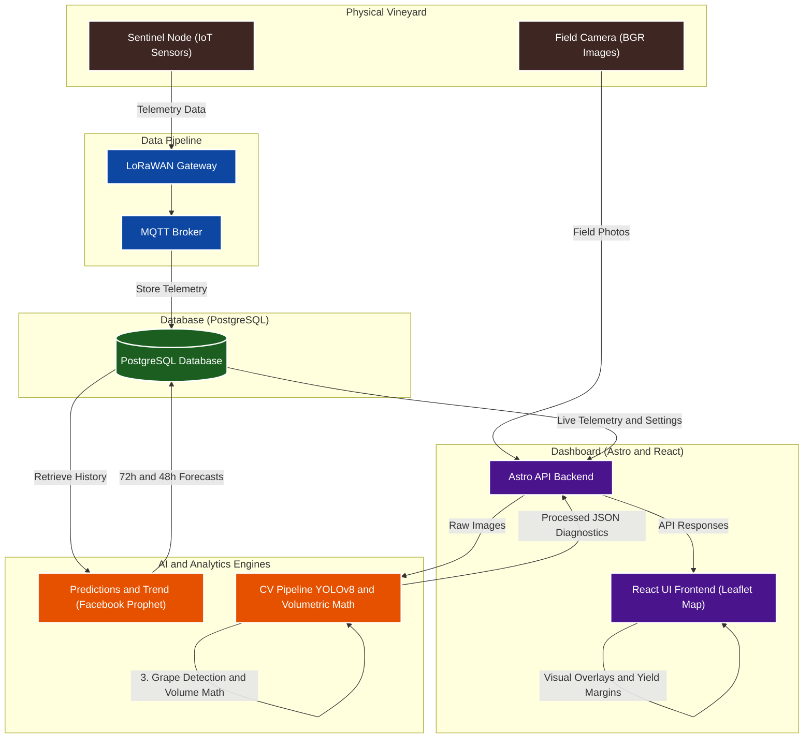

<h1>EdgeVine 🍇</h1>
EdgeVine is an advanced precision viticulture platform that seamlessly integrates IoT telemetry, predictive analytics, and Computer Vision to monitor vineyard health and estimate wine yield in real-time.

## Table of Contents
- [Table of Contents](#table-of-contents)
- [🎯 1. Overview](#-1-overview)
- [🔌 2. Hardware Implementation \& Setup](#-2-hardware-implementation--setup)
- [📊 3. Dashboard](#-3-dashboard)
  - [🗺️ 3.1. Interactive Map (Vigna Layout Editor)](#️-31-interactive-map-vigna-layout-editor)
  - [📢 3.2. Neighbor Alerts Page](#-32-neighbor-alerts-page)
  - [📈 3.3. Comprehensive Statistics](#-33-comprehensive-statistics)
  - [📸 3.4. Manual Inference Console](#-34-manual-inference-console)
  - [⚙️ 3.5. Unified Settings](#️-35-unified-settings)
- [👁️ 4. CV Pipeline](#️-4-cv-pipeline)
  - [4.1. Yield Estimation (Mathematical Model)](#41-yield-estimation-mathematical-model)
- [🧠 5. Predictive Analytics \& Telemetry Forecasting](#-5-predictive-analytics--telemetry-forecasting)
- [🚀 6. Getting Started](#-6-getting-started)

---

## 🎯 1. Overview
EdgeVine bridges the gap between agricultural tradition and modern artificial intelligence. By deploying a network of low-power sensors across vineyard sectors, the system continuously aggregates micro-climate data. This telemetry is fused with a robust, two-stage YOLOv8 Computer Vision pipeline capable of analyzing field imagery to detect early signs of phytosanitary stress (diseases, water deficit) and mathematically projecting harvest volum, helping winemakers make data-driven decisions for their production.



---

## 🔌 2. Hardware Implementation & Setup

To complete 

---

## 📊 3. Dashboard
EdgeVine features a responsive, real-time decision center powered by Astro and React for precision viticulture management.

### 🗺️ 3.1. Interactive Map (Vigna Layout Editor)
Draw sector boundaries, configure row spacing/orientation, and place IoT sentinel nodes interactively. Sectors dynamically update color based on CV health diagnostics and sensor alerts.

<p align="left">
  
</p>


### 📢 3.2. Neighbor Alerts Page
A regional bulletin system allowing growers to publish and propagate localized phytosanitary, frost, or weather warnings to neighboring vineyards in the network.

<p align="left">
  
</p>


### 📈 3.3. Comprehensive Statistics
A centralized analysis console plotting real-time telemetry curves, future 72-hour soil moisture and 48-hour temperature AI forecasts (Prophet), and automated harvest yield estimations.

<p align="left">
  
</p>


### 📸 3.4. Manual Inference Console
An interactive workspace to drag-and-drop crop photographs and run on-demand YOLOv8 inference for instant leaf health diagnostics and cluster weight calculations.

<p align="left">
  
</p>


### ⚙️ 3.5. Unified Settings
Fine-tune global sensor alert limits, camera spatial calibration constants (focal length, distance), and predictive anomaly thresholds.

<p align="center">
  
</p>


> [!NOTE] 
> 🎥 The complete demo video is available for download <a href="vineyard-dashboard/public/readme_source/full_demo.zip?raw=true" download>here</a>.
---

## 👁️ 4. CV Pipeline
EdgeVine's non-invasive Computer Vision pipeline runs in parallel stages to diagnose vineyard health and estimate wine output:
- **🍃 Leaf Detection** (YOLOv8-Medium): YOLOv8-Medium isolates individual grapevine leaves, which are cropped and passed to the Health Classication model
- **Health Classication** (Nano-cls): classifies the leaves into three states: 

   | Class | Indicator | Visual Diagnostic |
   |---|---|---|
   | 🔴 **Disease** | High Risk | Visible fungal/bacterial pathology (e.g., Leaf Blight, Black Rot). |
   | 🟢 **Healthy** | Optimal | Pristine chlorophyll signature, intact vascular structure. |
   | 🟠 **Stress** | Warning | Severe water stress, heat damage, or early wood disease symptoms. |
- **🍇 Grape Detection** (YOLOv8-Nano): Isolates grape clusters in the canopy to prepare physical geometry datasets.


### 4.1. Yield Estimation (Mathematical Model)
EdgeVine translates 2D bounding boxes into physical liquid volume:

1. **Spatial Scale Ratio ($S$)**: Converts camera dimensions into physical space based on focal length ($f$), sensor width ($S_w$), row distance ($D$), and image resolution ($I_{\text{img}}$):

$$S = \frac{D \cdot S_w}{f \cdot I_{\text{img}}}$$

2. **Physical Dimensions**: The physical width ($w_i$) and height ($h_i$) of the grape cluster $i$ in millimeters are derived by scaling the bounding box pixel dimensions ($W_{i,\text{px}}$ and $H_{i,\text{px}}$):

$$w_i = W_{i,\text{px}} \cdot S$$

$$h_i = H_{i,\text{px}} \cdot S$$

3. **Biomass Mass Estimation**: Approximates cluster depth as 10% of its physical area. Multiplying by the biological grape density ($\rho_{\text{grape}} = 0.8\text{ g/cm}^3$) yields the estimated cluster weight in grams ($m_i$):

$$ m_i = (w_i \cdot h_i \cdot 0.1) \cdot \rho_{\text{grape}}$$

4. **Wine Yield**: The combined weight of all $N$ clusters is scaled by the chemical yield conversion efficiency ($\eta_{\text{yield}} = 0.7$) to estimate the total harvest in liters ($L$):

$$L = \left(\frac{\sum_{i=1}^{N}m_i}{1000}\right) \cdot \eta_{\text{yield}}$$

> **Calibration:** Fluctuations in row distance ($D$) are mitigated by dynamically calculating uncertainty ranges that is expressed in percentage in settings (default 10%) using a customizable margin.


---
## 🧠 5. Predictive Analytics & Telemetry Forecasting
EdgeVine leverages historical sensor data to anticipate critical climate and soil changes before they happen.
- **Soil Moisture (72h Forecast)**: Prophet models the trend using daily/weekly seasonal variations, treating temperature and rain forecasts as dynamic regressors to predict soil dryness.
- **Ambient Temperature (48h Forecast)**: Prophet fits daily temperature curves, utilizing relative air humidity as a regressor to foresee sudden thermal shifts.

Preventive Alarms: The generated prediction curves ($y_{\text{hat}}$ and its confidence intervals) are evaluated against agricultural thresholds. If values are predicted to breach safety margins (e.g., moisture falling below capacity or temperatures hitting $\le 2^\circ\text{C}$), the dashboard instantly flags a preemptive warning, allowing winemakers to intervene hours before the event actually occurs.
   
---

## 🚀 6. Getting Started

EdgeVine is containerized for streamlined deployment across environments.

1. **Environment Setup**
   Ensure Docker and Docker Compose are installed. Copy the example configuration to initialize your secrets:
   ```bash
   cp .env.example .env
   ```
   
2. **Launch the Platform**
   Build and boot the interconnected services (PostgreSQL Database, MQTT Broker, Prediction Engine, and Astro Dashboard):
   ```bash
   docker compose up --build
   ```

3. **Access the Dashboard**
   Navigate to `http://localhost:4321` to access the central monitoring console.