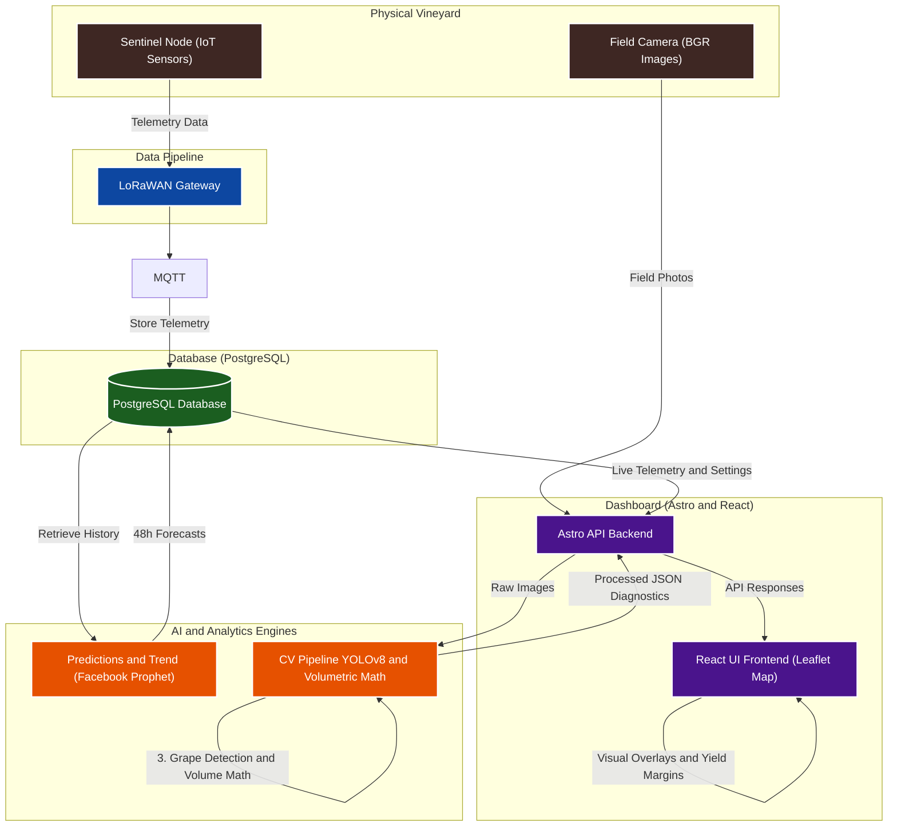
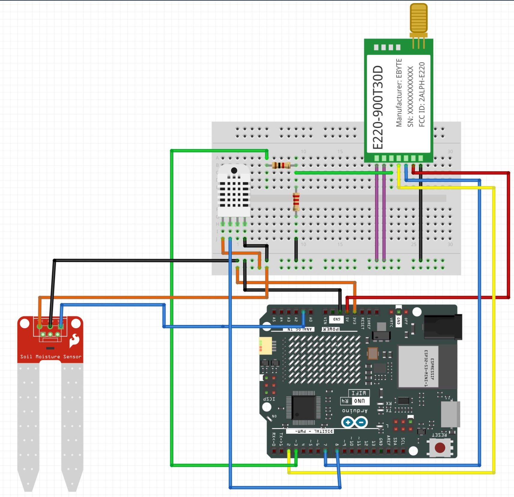
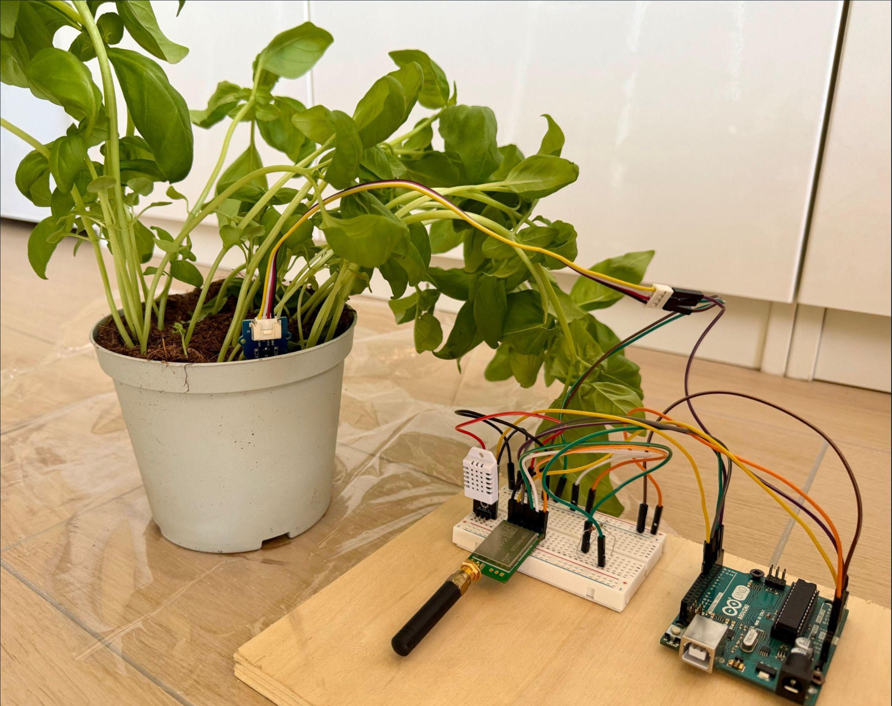
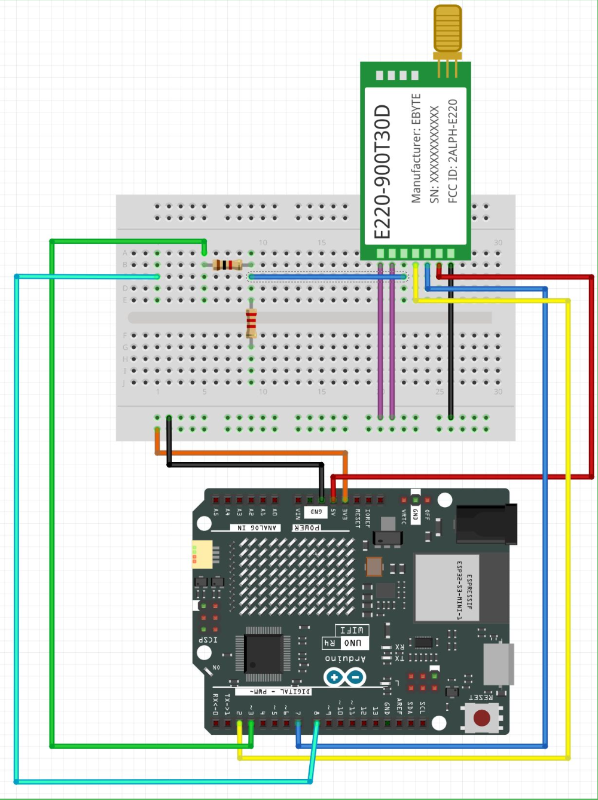
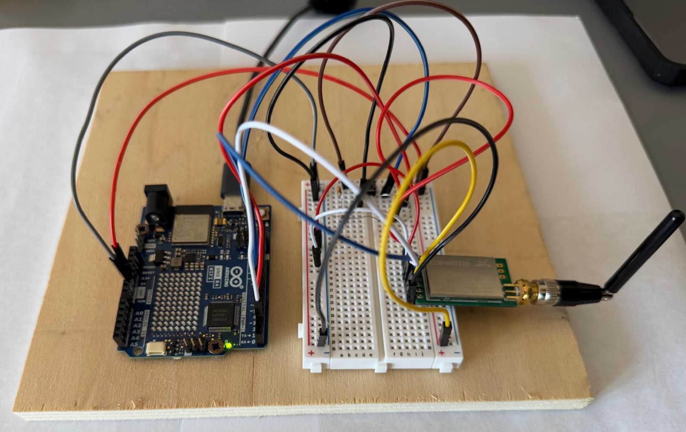
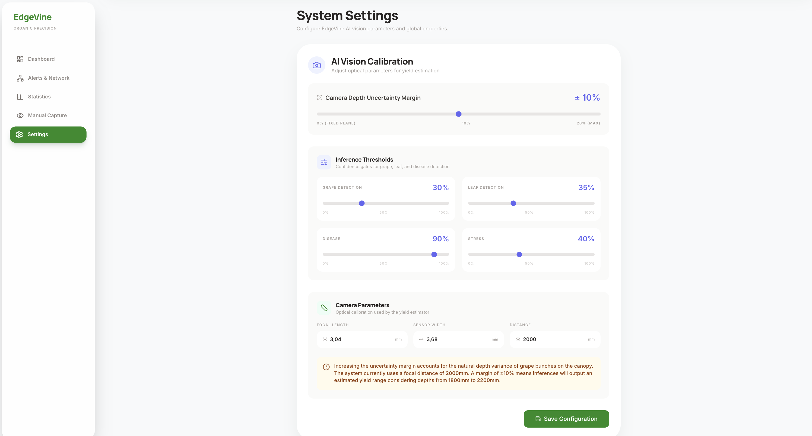

<h1>EdgeVine 🍇</h1>
EdgeVine is an advanced precision viticulture platform that seamlessly integrates IoT telemetry, predictive analytics, and Computer Vision to monitor vineyard health and estimate wine yield in real-time.

## Table of Contents
- [Table of Contents](#table-of-contents)
- [🎯 1. Overview](#-1-overview)
- [🔌 2. Hardware Implementation \& Setup](#-2-hardware-implementation--setup)
  - [1. Sentinel Units (Sensing Nodes)](#1-sentinel-units-sensing-nodes)
  - [2. Receiver Unit (Central Gateway)](#2-receiver-unit-central-gateway)
- [📊 3. Dashboard](#-3-dashboard)
  - [🗺️ 3.1. Interactive Map (Vigna Layout Editor)](#️-31-interactive-map-vigna-layout-editor)
  - [📢 3.2. Neighbor Alerts Page](#-32-neighbor-alerts-page)
  - [📈 3.3. Comprehensive Statistics](#-33-comprehensive-statistics)
  - [📸 3.4. Manual Inference Console](#-34-manual-inference-console)
  - [⚙️ 3.5. Unified Settings](#️-35-unified-settings)
- [👁️ 4. CV Pipeline](#️-4-cv-pipeline)
  - [🧠 4.1. Two-Stage YOLO Architecture](#-41-two-stage-yolo-architecture)
  - [📐 4.2. Yield Estimation (Mathematical Model)](#-42-yield-estimation-mathematical-model)
- [🧠 5. Predictive Analytics \& Telemetry Forecasting](#-5-predictive-analytics--telemetry-forecasting)
  - [📈 5.1. Soil Moisture (48h Forecast)](#-51-soil-moisture-48h-forecast)
  - [🌡️ 5.2. Ambient Temperature (48h Forecast)](#️-52-ambient-temperature-48h-forecast)
  - [🚨 5.3. Preemptive Alarm System](#-53-preemptive-alarm-system)
- [🚀 6. Getting Started](#-6-getting-started)
  - [🛠️ 6.1. Quick Start in 3 Steps](#️-61-quick-start-in-3-steps)

---

## 🎯 1. Overview
EdgeVine bridges the gap between agricultural tradition and modern artificial intelligence. By deploying a network of low-power sensors across vineyard sectors, the system continuously aggregates micro-climate data. This telemetry is fused with a robust, two-stage YOLOv8 Computer Vision pipeline capable of analyzing field imagery to detect early signs of phytosanitary stress (diseases, water deficit) and mathematically projecting harvest volum, helping winemakers make data-driven decisions for their production.



---

## 🔌 2. Hardware Implementation & Setup


### 1. Sentinel Units (Sensing Nodes)
Each vineyard zone or sector requires an independent Sentinel node containing the following hardware component stack:

| Component | Specifications / Model | Purpose |
| :--- | :--- | :--- |
| **Microcontroller Board** | Arduino Uno | Handles sensor polling and executes local transmission logic. |
| **Wireless Radio Module** | E220-900T30D LoRa Module (+ Antenna) | Transmits long-range telemetry signals across vineyard zones. |
| **Soil Sensor** | Moisture Sensor | Measures localized soil moisture data to monitor field capacity. |
| **Environmental Sensor** | External Temperature & Humidity Sensor | Collects microclimate data used as regressors for predictive analysis. |
| **Vision Module** | Webcam | Captures real-time frames for YOLOv8 leaf health and grape detection. |
  
  <p align="center">
    
      
    </p>

### 2. Receiver Unit (Central Gateway)
The central uplink gateway acts as the data hub and requires the following components:

| Component | Specifications / Model | Purpose |
| :--- | :--- | :--- |
| **Microcontroller Board** | Arduino Uno | Manages incoming radio packets from multiple Sentinel nodes. |
| **Wireless Radio Module** | E220-900T30D LoRa Module (+ Antenna) | Receives aggregated LoRa telemetry data from the field. |
| **Visual Interface** | LED Matrix Display | Provides real-time status, network diagnostics, or urgent visual indicators. |
| **Manual Trigger** | Push Button | General hardware interaction/diagnostic manual trigger. |
       
<p align="center">
    
      
    </p>

---

## 📊 3. Dashboard
EdgeVine features a responsive, real-time decision center powered by Astro and React for precision viticulture management.

### 🗺️ 3.1. Interactive Map (Vigna Layout Editor)
Draw sector boundaries, configure row spacing/orientation, and place IoT sentinel nodes interactively. Sectors dynamically update color based on CV health diagnostics and sensor alerts.

<p align="left">
  
</p>


### 📢 3.2. Neighbor Alerts Page
A regional bulletin system allowing growers to publish and propagate localized phytosanitary, frost, or weather warnings to neighboring vineyards in the network.

<p align="left">
  
</p>


### 📈 3.3. Comprehensive Statistics
A centralized analysis console plotting real-time telemetry curves, future 48-hour soil moisture and temperature AI forecasts (Prophet), and automated harvest yield estimations.

<p align="left">
  
</p>


### 📸 3.4. Manual Inference Console
An interactive workspace to drag-and-drop crop photographs and run on-demand YOLOv8 inference for instant leaf health diagnostics and cluster weight calculations.

<p align="left">
  
</p>


### ⚙️ 3.5. Unified Settings
Fine-tune global sensor alert limits, camera spatial calibration constants (focal length, distance), and predictive anomaly thresholds.

<p align="left">
  
</p>


> [!NOTE] 
> 🎥 The complete demo video is available for download [here](https://github.com/Lori-in-the-clouds/EdgeVine/raw/main/vineyard-dashboard/public/readme_source/full_demo.zip).
---

## 👁️ 4. CV Pipeline

EdgeVine’s non-invasive Computer Vision pipeline leverages multi-stage deep learning to perform real-time phytosanitary diagnostics and precise crop-yield estimations.

### 🧠 4.1. Two-Stage YOLO Architecture

The pipeline processes high-resolution field images through two parallel neural network tracks:

1. **🍃 Canopy Diagnostics (Two-Stage Classifier)**
   * **Stage 1 (Detection - YOLOv8-Medium):** Automatically detects and isolates individual grapevine leaves, cropping bounding boxes from the raw frame.
   * **Stage 2 (Classification - YOLOv8-Nano-cls):** Processes each cropped leaf to determine its physiological health status:

     | Class | Indicator | Visual Diagnostic |
     | :---: | :--- | :--- |
     | 🔴 **Disease** | High Risk | Visible active pathology (e.g., Leaf Blight, Black Rot). |
     | 🟢 **Healthy** | Optimal | Pristine chlorophyll signature, intact vascular structure. |
     | 🟠 **Stress** | Warning | Severe water deficit, heat stress, or early wood disease symptoms. |

2. **🍇 Yield Assessment (YOLOv8-Nano):** Detects and segments active grape clusters within the canopy, passing their physical pixel coordinates ($W_{\text{px}}, H_{\text{px}}$) to the volumetric math engine.

### 📐 4.2. Yield Estimation (Mathematical Model)

EdgeVine translates 2D pixel bounding boxes into physical liquid volume estimates of wine through a 4-step geometric pipeline:

1. **Spatial Scale Ratio ($S$):** Converts camera pixel dimensions into physical space based on focal length ($f$), sensor width ($S_w$), row distance ($D$), and image resolution ($I_{\text{img}}$):

    $$S = \frac{D \cdot S_w}{f \cdot I_{\text{img}}}$$

2. **Physical Dimensions ($w_i, h_i$):**
Derives the actual physical width ($w_i$) and height ($h_i$) of the grape cluster $i$ in millimeters by scaling its pixel bounding box ($W_{i,\text{px}}, H_{i,\text{px}}$):

    $$w_i = W_{i,\text{px}} \cdot S$$

    $$h_i = H_{i,\text{px}} \cdot S$$

3. **Biomass Mass Estimation ($m_i$):** Approximates the cluster's physical depth as 10% of its physical area. Multiplying by the biological grape density ($\rho_{\text{grape}} = 0.8\text{ g/cm}^3$) yields the estimated cluster weight in grams:

    $$m_i=(w_i \cdot h_i \cdot 0.1)\cdot\rho_{\text{grape}}$$

4. **Final Wine Yield ($L$):** Aggregates the weight of all $N$ detected clusters, scaling the total biomass by the chemical wine conversion efficiency ($\eta_{\text{yield}} = 0.7$) to forecast the yield in liters:

    $$L = \left(\frac{\sum_{i=1}^{N}m_i}{1000}\right) \cdot \eta_{\text{yield}}$$

> [!NOTE]
> **Dynamic Calibration:**
> Natural depth fluctuations caused by row distance variance ($D$) are dynamically mitigated. The Settings Console allows winemakers to configure an uncertainty margin (default `±10%`), which automatically projects a safety buffer for the final yield estimate.


---
## 🧠 5. Predictive Analytics & Telemetry Forecasting

EdgeVine doesn't just monitor the present—it anticipates the future. By feeding historical timeseries telemetry into robust **Facebook Prophet** forecasting models, the platform predicts critical soil and atmospheric changes before they can impact crop health.

> [!TIP]
> **Model Development & Testing:**
> The complete training pipeline, parameter tuning, and exploratory data analysis (EDA) for these forecasting models are documented in the experimental [Jupyter Notebook](Predictions/prophet_analysis.ipynb).

### 📈 5.1. Soil Moisture (48h Forecast)
Predicts soil dryness trends to optimize automated irrigation schedules and prevent hydric stress.
* 🔮 **Forecasting Window:** 48 Hours ahead.
* ⚙️ **Mathematical Modeling:** Prophet captures daily and weekly seasonal variations. 
* 🌦️ **Dynamic Regressors:** To maximize accuracy, the model treats future **ambient temperature** and **meteorological rain forecasts** as dynamic external regressors.

### 🌡️ 5.2. Ambient Temperature (48h Forecast)
Foresees sudden thermal shifts to protect vulnerable shoots from frost damage and heat waves.
* 🔮 **Forecasting Window:** 48 Hours ahead.
* ⚙️ **Mathematical Modeling:** Fits diurnal temperature curves (day/night cycles).
* 💧 **Dynamic Regressors:** Utilizes **relative air humidity** as a dynamic regressor to anticipate microclimate shifts.


### 🚨 5.3. Preemptive Alarm System

The generated prediction curves ($\hat{y}$) and their corresponding uncertainty intervals (confidence bands) are continuously evaluated in real-time against customizable agronomic safety limits.

> [!WARNING]
> **Preemptive Alerts & Active Intervention:**
> If a forecasted curve is projected to breach a safety threshold within its lookahead window, the central console instantly flags a preemptive alert:
> * 💧 **Drought Warning:** Forecasted soil moisture falling below critical field capacity.
> * ❄️ **Frost Alert:** Forecasted temperatures hitting $\le 2^\circ\text{C}$ (triggering active frost-protection measures).
> 
> Winemakers are notified **hours before the event actually occurs**, turning reactive crisis management into proactive, data-driven crop protection.

---

## 🚀 6. Getting Started

EdgeVine is fully containerized using **Docker** and **Docker Compose**, orchestrating its multi-service architecture (PostgreSQL, MQTT, AI models, and the Astro frontend) into a single, cohesive local deployment.

> [!IMPORTANT]
> **Prerequisites:** Ensure you have [Docker Desktop](https://www.docker.com/products/docker-desktop/) (which includes Docker Compose) installed and running on your host system before proceeding.

### 🛠️ 6.1. Quick Start in 3 Steps

Follow these steps to deploy and access the EdgeVine platform on your local machine:

1. **Environment Setup:** First, copy the example environment template to configure your local credentials and system secrets:

    ```bash
    # Duplicate the environment template
    cp .env.example .env
    ```

    You can open the newly created `.env` file to customize environmental thresholds, PostgreSQL passwords, or the MQTT broker credentials if you plan to link physical sentinel nodes.

2. **Spin Up the Stack:** Orchestrate and launch the entire microservice ecosystem. Docker will download the baseline images, build the custom layers, and boot the inter-service network:

    ```bash
    # Build containers and launch the ecosystem
    docker compose up --build
    ```
    Once the stack is running, the following services will be available:
    | Service | Port | Description |
    | :--- | :---: | :--- |
    | 🌐 **Astro & React WebApp** | `4321` | The central viticulture control dashboard. |
    | 🧠 **CV & Prediction Engine** | `5001` | Runs the live YOLOv8 crop vision pipeline and trend forecasts. |
    | 🗄️ **PostgreSQL Database** | `5432` | Stores timeseries telemetry, vineyard boundaries, and model coefficients. |
    | 🔌 **Mosquitto MQTT Broker** | `1883` | Manages low-latency message streaming from the Sentinel sensor fleet. |

3. **Open the Dashboard:** Once the startup logs stabilize, open your preferred browser and navigate to the local portal to begin managing your viticulture mapping, alerts, and vision diagnostics:
<div align="center">
  
   <a href="http://localhost:4321">
      🔗 🍇 Open EdgeVine Dashboard  (http://localhost:4321)
  </a>
</div>

---


